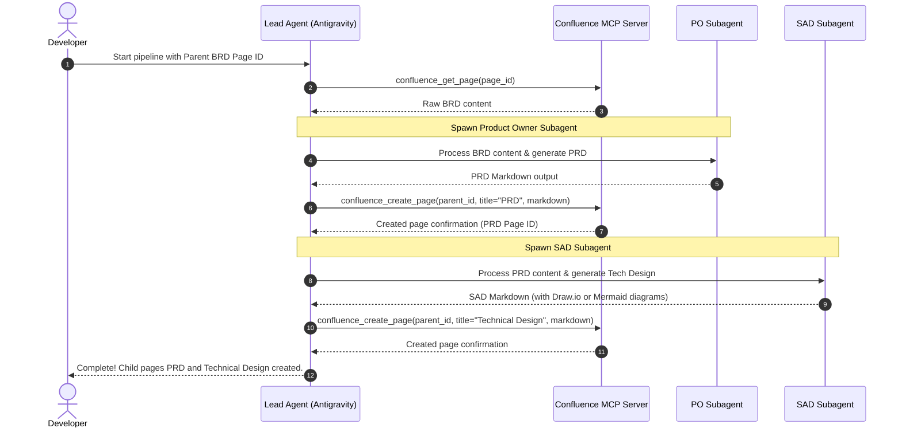

# Confluence BRD-to-PRD-SAD Agent Orchestrator (MCP-Based)

[](#)
[](#)
[](#)

An automated, agentic pipeline built using **Antigravity subagents** and the **Model Context Protocol (MCP)**. This system automates the product engineering lifecycle by retrieving a Business Requirements Document (BRD) from Confluence, analyzing it to create a Product Requirements Document (PRD), performing system architecture design (SAD), and uploading both as nested assets back to Confluence.

---

## 📐 Architecture Overview



---

## 🗂 Workspace Map

To prevent worker agents from getting disoriented or writing files out of bounds, please refer to the [Workspace Map](project_map.md) for details on the structure. Here is a quick layout overview:

- `/mcp-server/`: The Python implementation of the `mcp-atlassian` server.
- `/.gemini/config.json`: The local tool configuration to automatically load Confluence and Draw.io MCP packages.
- `/agent_profiles/`: Contain the worker agents' specialized system prompts and global behavior rules.
- `/project_map.md`: System file layout and agent rule map.

---

## 🛠 Setup & Installation

### 1. Prerequisites
- **uv** (astral-sh/uv) to run Python-based MCP servers like `mcp-atlassian`.
- **Node.js** & **npm/npx** for running `@drawio/mcp`.
- **Antigravity CLI** or MCP-compatible host.
- A **Confluence Cloud** account with:
  - Base URL (e.g., `https://your-domain.atlassian.net`)
  - User Email
  - API Token (generated via Atlassian account security settings)

### 2. Configure MCP Server
The repository utilizes a local configuration via `.gemini/config.json`. Ensure the environment variables match your workspace context:

```json
{
  "mcpServers": {
    "confluence-mcp-server": {
      "command": "uvx",
      "args": ["mcp-atlassian"],
      "env": {
        "CONFLUENCE_URL": "https://your-domain.atlassian.net",
        "CONFLUENCE_USERNAME": "your-email@example.com",
        "CONFLUENCE_API_TOKEN": "your-atlassian-api-token"
      }
    },
    "drawio-mcp": {
      "command": "npx",
      "args": ["-y", "@drawio/mcp"]
    }
  }
}
```

Antigravity will auto-discover this local configuration on startup. Ensure `.env` is populated with these secrets if required by the pipeline scripts.

---

## 🤖 Running the Pipeline

Once the MCP Server is registered and active, you can instruct Antigravity to run the pipeline using the following command:

> *"Antigravity, please run the BRD-to-PRD-SAD pipeline for Confluence Page ID **[INSERT_PAGE_ID_HERE]**."*

Antigravity will automatically handle:
1. Fetching the BRD using `confluence_get_page`.
2. Spawning the **Product Owner** subagent (`po_prompt.md`) to write the PRD and upload it as a sub-page.
3. Spawning the **System Architect** subagent (`sad_prompt.md`) to analyze the generated PRD, draft the technical design utilizing `drawio-mcp` or Mermaid charts, and upload it as a sub-page.

---

## 👥 5-Programmer Collaboration Playbook

To build, verify, and maintain this project, we allocate responsibilities among a team of 5 programmers as follows:

| Role | Core Target | Primary Ownership |
| :--- | :--- | :--- |
| **Programmer 1: Lead Architect** | System integrity, pipeline runner | `README.md`, `project_map.md`, `.gemini/config.json` |
| **Programmer 2: Atlassian Integrator** | Confluence and Jira bridge | `/mcp-server/` Python tools |
| **Programmer 3: Product Owner Agent Eng.** | PRD quality & business rules | `/agent_profiles/po_prompt.md` |
| **Programmer 4: SAD Agent Eng.** | Tech doc quality & diagram syntaxes | `/agent_profiles/sad_prompt.md` |
| **Programmer 5: QA & DevOps** | Validation pipelines & security testing | Automated validation, testing, and secret scanner configs |
