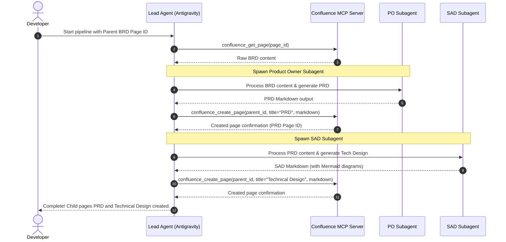

# 📘 Codebase Analysis: Confluence BRD-to-PRD-SAD Agent Orchestrator

The **Confluence BRD-to-PRD-SAD Agent Orchestrator** is an automated, agentic pipeline built using **Antigravity subagents** and the **Model Context Protocol (MCP)**. This system automates the product engineering lifecycle by retrieving a Business Requirements Document (BRD) from Confluence, analyzing it to create a Product Requirements Document (PRD), performing system architecture design (SAD), and uploading both as nested assets back to Confluence.

---

## 📐 Pipeline & Interaction Flow

The pipeline orchestrates interactions between the lead agent (Antigravity), the custom Confluence MCP Server, and two specialized worker subagents:



---

## 🗺 Directory & Architecture Map

```
confluence-mcp-orchestrator/ (Root)
│
├── .gitignore                   <-- Version control exclusions
├── README.md                    <-- Project execution playbook & installation guide
├── project_map.md               <-- Spatial mapping and behavioral contract for worker agents
│
├── agent_profiles/              <-- System instructions and prompts for worker agents
│   ├── global_rules.md          <-- Foundation requirements & formatting constraints (e.g., Mermaid formatting)
│   ├── po_prompt.md             <-- Domain instructions for the Product Owner (PO) Agent
│   └── sad_prompt.md            <-- Domain instructions for the System Architect & Designer (SAD) Agent
│
└── mcp-server/                  <-- Source code for the Confluence MCP integration
    ├── package.json             <-- Project metadata & node dependencies
    ├── tsconfig.json            <-- TypeScript build configuration
    └── src/
        ├── index.ts             <-- Core MCP Server tool register & request router
        └── confluence.ts        <-- Confluence REST API v2 client and Markdown parser
```

---

## ⚙️ Core Technical Modules

### 1. Confluence MCP Server (`/mcp-server`)
Written in Node.js and TypeScript, the server uses standard Model Context Protocol (MCP) to register two primary tools for the lead agent to interact with Atlassian Confluence:

*   **`confluence_get_page`**:
    *   **Description**: Retrieves a Confluence page's storage content and metadata by Page ID.
    *   **Details**: Performs a `GET /wiki/api/v2/pages/{pageId}` call with `body-format=storage` to receive XHTML formatted content.
*   **`confluence_create_page`**:
    *   **Description**: Creates a new nested child page under an existing parent page with specified markdown content.
    *   **Details**: Resolves the parent space ID, converts Markdown content into clean basic XHTML using a lightweight internal compiler, and creates the page using a `POST /wiki/api/v2/pages` payload.

> [!NOTE]
> **XHTML Compilation**: The custom parser converts headings (`#` to `<h1>`, `##` to `<h2>`), bold/italic formatting, code blocks, bullet points, and basic line breaks to ensure Confluence renders the markdown beautifully as native storage format.

### 2. Specialized Worker Prompts (`/agent_profiles`)

*   **`global_rules.md`**: Imposes quality, tone, and formatting constraints.
    *   *No Placeholders*: Zero use of TODOs, ellipses, or "TBD"s.
    *   *Mermaid Strictness*: Restricts HTML inside node labels and mandates quotes around labels with punctuation to avoid rendering breakages.
*   **`po_prompt.md`**: Directs the **Product Owner** subagent to translate a business-centric BRD into a product specification. Focuses strictly on *what* and *why*:
    *   Target Personas, Scope Boundaries (In-Scope vs. Out-of-Scope).
    *   Structured GFM User Stories (`US-[N]`) and Gherkin Acceptance Criteria (`Given / When / Then`).
*   **`sad_prompt.md`**: Directs the **System Architect & Designer** subagent to build the *how*:
    *   System Paradigm and Topology.
    *   REST / API specification schemas and relational database tables.
    *   Mermaid flowcharts and sequence diagrams mapping to the PRD's functional requirements.
    *   Security, Authorization, and Infrastructure assumptions.

---

## 👥 Responsibility Allocation Playbook

For team projects, responsibilities are mapped to five distinct owner roles:

| Role | Primary Ownership | Core Target |
| :--- | :--- | :--- |
| **Programmer 1: Lead Architect** | `README.md`, `project_map.md` | System integrity, pipeline runner, orchestrator config |
| **Programmer 2: MCP Server Developer** | `/mcp-server/src/` | Confluence API integration & tool structure |
| **Programmer 3: PO Agent Engineer** | `/agent_profiles/po_prompt.md` | PRD completeness, persona rules, and business mapping |
| **Programmer 4: SAD Agent Engineer** | `/agent_profiles/sad_prompt.md` | SAD quality, API specification standards, and Mermaid rendering |
| **Programmer 5: QA & DevOps** | Validation pipelines | Automating Mermaid syntax checks, security auditing, credential protection |

---

## 🚀 Running the Pipeline

To execute this automated pipeline:
1.  **Environment Setup**: Navigate to `/mcp-server`, run `npm install` and build using `npm run build`. Configure the `.env` with `CONFLUENCE_URL`, `CONFLUENCE_EMAIL`, and `CONFLUENCE_API_TOKEN`.
2.  **Server Registration**: Register the built script with your Antigravity client config.
3.  **Command execution**: Provide the parent Confluence page ID of the BRD to Antigravity and let the orchestrator spawn its agents to complete the cycle:
    > *"Antigravity, please run the BRD-to-PRD-SAD pipeline for Confluence Page ID **[INSERT_PAGE_ID_HERE]**."*
