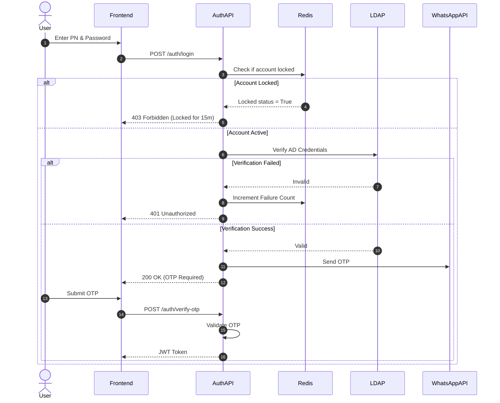

# System Architecture Document (SAD): Login Module Fixed Asset Management

## 1. System Topology & Overview
- **Architectural Paradigm**: Microservices/SOA. A dedicated Authentication Service handles the login flow to keep security concerns decoupled from the core Asset Management logic.
- **Component Diagram**: 
  - **Frontend Client**: SPA handling user inputs.
  - **Auth Gateway / API**: Validates inputs, manages rate-limiting, and Captcha verification.
  - **AD Connector**: Secure module to communicate with the internal LDAP.
  - **Notification Service**: Coordinates sending OTP via WhatsApp API and SMS.
  - **Redis Cache**: Tracks failed login attempts, lockout periods, and active sessions.

## 2. API Specifications & Contracts
- **`[POST /api/v1/auth/login]`**
  - **Request Body**: `{"pn": "12345678", "password": "...", "captchaToken": "..."}`
  - **Successful Response (200 OK)**: `{"status": "OTP_REQUIRED", "session_token": "temp_xyz"}`
  - **Error States**: `401 Unauthorized` (Wrong credentials), `403 Forbidden` (Account Locked), `400 Bad Request` (Invalid Captcha).

- **`[POST /api/v1/auth/verify-otp]`**
  - **Request Body**: `{"session_token": "temp_xyz", "otp": "123456"}`
  - **Successful Response (200 OK)**: `{"access_token": "jwt_token_encrypted_AES256"}`
  - **Error States**: `401 Unauthorized` (Wrong or Expired OTP).

## 3. Relational / Document Database Schema
- **Audit Log Table**:
  - `id` (PK)
  - `TIMESTAMP` (DATETIME)
  - `USER_PN` (VARCHAR 8)
  - `IP_ADDRESS` (VARCHAR 45)
  - `STATUS_LOGIN` (ENUM SUCCESS/FAILED)
  - `FAILURE_REASON` (VARCHAR 100)

(Note: No passwords or AD credentials are saved in the local database)

## 4. Sequence & Logic Flows (Diagrams)

## 5. Security & Infrastructure Assumptions
- **Data Protection**: TLS v1.2/1.3 enforced. JWT encrypted with AES-256. Passwords passed directly to LDAP and wiped from memory.
- **Authentication & Authorization**: Post-OTP, a short-lived, encrypted JWT handles session state. Session expires after 15m idle time.
- **Rate Limiting & Scalability**: Redis handles Captcha triggers after 2 failed attempts and 15-minute lockouts after 3 failed AD attempts.
